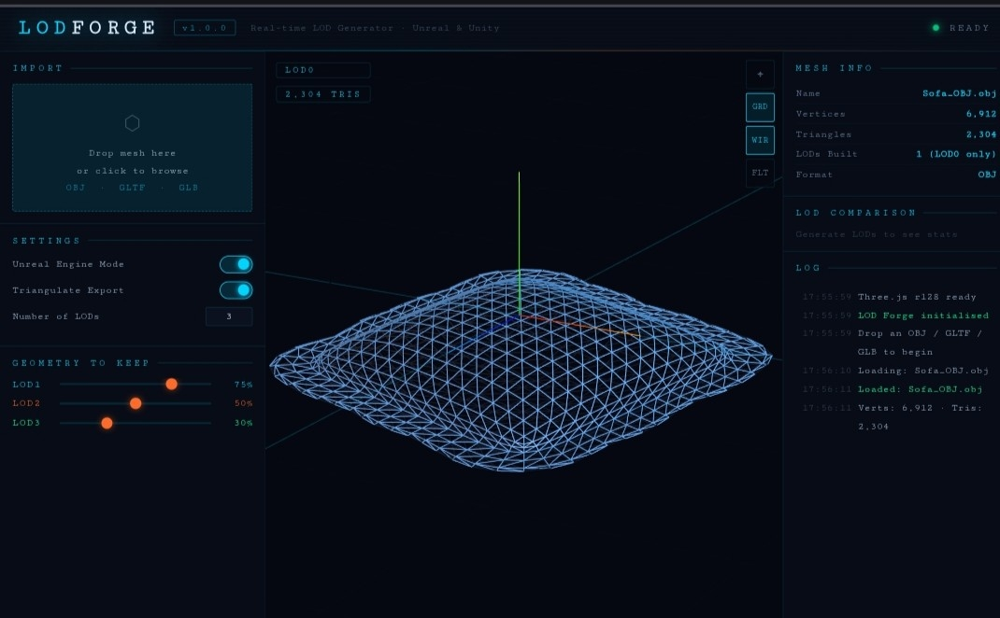

# LOD FORGE

**Real-time LOD Generator — Standalone Browser Tool for Unreal Engine & Unity**


---

## Overview

LOD Forge is a lightweight, browser-based LOD generation tool that requires no installation, no Blender, and no server. Open the HTML file, drop a mesh, set your reduction ratios, and export engine-ready GLB files.

Built as a companion to the [Blender LOD Generator addon](../lod-generator-blender), LOD Forge targets fast iteration and quick exports — especially useful when you need to process meshes outside of a DCC pipeline.


> *Dark sci-fi UI with real-time 3D preview, LOD comparison table, and live log output*

---

## Features

| Feature | Details |
|---|---|
| **No installation** | Single `.html` file — open in any modern browser |
| **Drag & drop import** | Drop directly onto the viewport or the import zone |
| **Formats** | OBJ · GLTF · GLB |
| **LOD generation** | Up to 6 levels using Three.js SimplifyModifier (Garland-Heckbert) |
| **Live 3D preview** | OrbitControls, wireframe, flat shading, grid toggle |
| **LOD tab switcher** | Click LOD0–LODn tabs to compare reduction in real time |
| **Export: ZIP** | All LOD levels packed into a single `.zip` |
| **Export: Separate** | Each LOD as its own `.glb` file |
| **Unreal Engine mode** | Applies `SM_` prefix convention and `_LOD0`–`_LODn` naming for UE5 import |
| **Unity mode** | Standard naming, no prefix |
| **Stats panel** | Vertex/triangle count per LOD with visual comparison bars |
| **Log panel** | Timestamped operation log |

---

## Quick Start

### Option A — Directly in browser (internet required for CDN scripts)

1. Download `lod_forge.html`
2. Open it in Chrome, Firefox, or Edge
3. Drop a mesh file onto the import zone or the viewport
4. Adjust LOD ratios using the sliders
5. Click **Generate LODs** — preview each level using the tab bar
6. Click **Export ZIP** or **Export Separate GLBs**

### Option B — Fully offline (recommended for production use)

Download the required scripts once and serve locally:

```bash
# Create a local deps folder
mkdir lod_forge_deps && cd lod_forge_deps

# Download Three.js and all required modules
curl -O https://cdn.jsdelivr.net/npm/three@0.128.0/build/three.min.js
curl -O https://cdn.jsdelivr.net/npm/three@0.128.0/examples/js/controls/OrbitControls.js
curl -O https://cdn.jsdelivr.net/npm/three@0.128.0/examples/js/loaders/GLTFLoader.js
curl -O https://cdn.jsdelivr.net/npm/three@0.128.0/examples/js/loaders/OBJLoader.js
curl -O https://cdn.jsdelivr.net/npm/three@0.128.0/examples/js/modifiers/SimplifyModifier.js
curl -O https://cdn.jsdelivr.net/npm/three@0.128.0/examples/js/exporters/GLTFExporter.js
curl -O https://cdnjs.cloudflare.com/ajax/libs/jszip/3.10.1/jszip.min.js
```

Then update the `<script src="...">` tags in `lod_forge.html` to point to local paths, and open the file from a local server:

```bash
# Python quick server
python -m http.server 8080
# then open http://localhost:8080/lod_forge.html
```

### Option C — Electron (desktop app with full offline + filesystem access)

See [Electron packaging guide](#electron-packaging) below.

---

## Interface Reference

### Left Panel

| Control | Description |
|---|---|
| **Import zone** | Click or drag & drop OBJ / GLTF / GLB |
| **Unreal Engine Mode** | Toggles `SM_` prefix and UE5 LOD naming convention |
| **Triangulate Export** | Include triangulation flag during GLB export |
| **Number of LODs** | 1–6 levels below LOD0 (LOD0 is always the original mesh) |
| **LOD sliders** | Percentage of geometry to keep per level (1%–99%) |
| **Generate LODs** | Run SimplifyModifier for all configured levels |
| **Export ZIP** | Export all LODs as a single `.zip` archive |
| **Export Separate GLBs** | Download each LOD as an individual `.glb` file |

### Viewport Controls

| Button | Action |
|---|---|
| `⌖` | Reset camera to default position |
| `GRD` | Toggle grid and axes helper |
| `WIR` | Toggle wireframe rendering |
| `FLT` | Toggle flat shading |

**Mouse navigation:** Left-drag to orbit · Right-drag or middle-drag to pan · Scroll to zoom

### LOD Tab Bar

Click any LOD tab at the bottom of the viewport to switch the preview to that LOD level. Triangle count updates in the overlay badge in real time.

### Right Panel

- **Mesh Info** — name, vertex count, triangle count, LOD count, format
- **LOD Comparison** — bar chart showing relative triangle density per LOD
- **Log** — timestamped operation log for all actions and errors

---

## Export & Engine Integration

### Unreal Engine 5

Enable **Unreal Engine Mode** before exporting. The tool will:
- Prefix asset names with `SM_` (e.g. `SM_Rock_LOD0.glb`, `SM_Rock_LOD1.glb`)
- Name each LOD file with the `_LOD{n}` suffix

**Import into UE5:**
1. Install the [GLTF Importer plugin](https://docs.unrealengine.com/5.0/en-US/gltf-importer-in-unreal-engine/) (bundled since UE 5.0)
2. Import `SM_YourAsset_LOD0.glb` — UE5 will auto-detect the LOD chain if other `_LOD{n}` files are in the same folder
3. Or import each file separately and assign LOD levels manually in the Static Mesh Editor

> **Note:** GLTF does not carry an FBX-style `LodGroup` property. For automatic LOD detection via FBX, use the companion Blender addon instead.

### Unity

Disable **Unreal Engine Mode**. Files will export without the `SM_` prefix.

**Import into Unity:**
1. Drag all LOD GLB files into your Unity project folder
2. Create an empty GameObject
3. Add a `LODGroup` component
4. Assign the imported meshes to each LOD slot

---

## LOD Ratio Guidelines

| LOD | Keep % | Use Case |
|---|---|---|
| LOD0 | 100% | Hero / close-up |
| LOD1 | 70–75% | Near-mid distance |
| LOD2 | 45–55% | Mid distance |
| LOD3 | 25–35% | Far distance |
| LOD4 | 10–18% | Distant / silhouette |
| LOD5 | 4–8% | Billboard transition or impostor |

Hard-surface assets (vehicles, buildings) can drop more aggressively than organic meshes (characters, vegetation).

---

## Technical Notes

### SimplifyModifier

LOD Forge uses **Three.js SimplifyModifier** (Garland-Heckbert quadric error metric) — the same algorithm used in Blender's Decimate modifier (Collapse mode).

The modifier operates synchronously on the main browser thread. For very high-poly meshes (500k+ triangles) the browser may briefly freeze during generation — this is expected. A loading overlay is shown during processing.

The modifier requires non-indexed geometry as input. LOD Forge converts indexed geometry automatically via `toNonIndexed()` before simplification.

### Export Format

All exports use **GLB (binary GLTF 1.0 container)** via Three.js `GLTFExporter`. GLB is:
- Natively supported in Unreal Engine 5.0+ (GLTF Importer plugin)
- Natively supported in Unity 2020.2+
- Widely supported across 3D tools (Blender, Maya, Cinema 4D, etc.)

### Browser Compatibility

| Browser | Status |
|---|---|
| Chrome 90+ | ✅ Recommended |
| Firefox 88+ | ✅ Fully supported |
| Edge 90+ | ✅ Fully supported |
| Safari 15+ | ⚠️ Supported (some GLB download quirks) |

---

## Electron Packaging

To run LOD Forge as a native desktop app with full offline support and filesystem access:

```bash
# Init project
mkdir lod-forge-electron && cd lod-forge-electron
npm init -y
npm install --save-dev electron

# Copy lod_forge.html as index.html
cp /path/to/lod_forge.html index.html
```

Create `main.js`:

```javascript
const { app, BrowserWindow } = require('electron');
const path = require('path');

function createWindow() {
  const win = new BrowserWindow({
    width: 1400,
    height: 900,
    titleBarStyle: 'hiddenInset',
    webPreferences: { nodeIntegration: false }
  });
  win.loadFile('index.html');
}

app.whenReady().then(createWindow);
app.on('window-all-closed', () => { if (process.platform !== 'darwin') app.quit(); });
```

```bash
npx electron .
```

For distributable builds, use [electron-builder](https://www.electron.build/).

---

## Comparison: LOD Forge vs Blender Addon

| | LOD Forge (this tool) | Blender LOD Generator |
|---|---|---|
| **Requires Blender** | No | Yes (3.6+) |
| **Input formats** | OBJ, GLTF, GLB | Any Blender-supported format |
| **Output formats** | GLB only | FBX (recommended), GLB |
| **Unreal LodGroup** | Naming convention only | Full FBX `LodGroup` property |
| **Live modifier** | No (applied) | Yes (non-destructive Decimate) |
| **Simplification** | SimplifyModifier | Decimate (same algorithm) |
| **Batch processing** | One mesh at a time | Multiple meshes per session |
| **Best for** | Quick exports, no DCC | Full pipeline, UE5 FBX import |

---

## Project Structure

```
lod-forge/
├── lod_forge.html       ← Single-file application (open this)
├── README.md
└── docs/
    └── screenshot.png
```

---

## Related Tools

- **[LOD Generator — Blender Addon](../lod-generator-blender)** — Non-destructive LOD generation and FBX export from inside Blender
- **[X-File Texture Swapper](../x-file-texture-swapper)** — Batch texture replacement for DirectX .x mesh files
- **[Facade Texture Pro](../facade-texture-pro)** — Architectural facade texture generation pipeline

---

## Changelog

### v1.0.0
- Initial release
- OBJ / GLTF / GLB import via Three.js loaders
- LOD generation with SimplifyModifier (up to 6 levels)
- Real-time 3D preview with OrbitControls
- Wireframe, flat shading, grid toggle
- LOD tab switcher with live triangle count overlay
- ZIP export and separate GLB export
- Unreal Engine / Unity naming modes
- Mesh info stats panel + LOD comparison bar chart
- Timestamped log panel

---

## License

MIT — free to use, modify, and redistribute. Attribution appreciated.

---

*Part of the [Simulation & Real-time Asset Pipeline](https://github.com/EldadEinav) toolset.*
